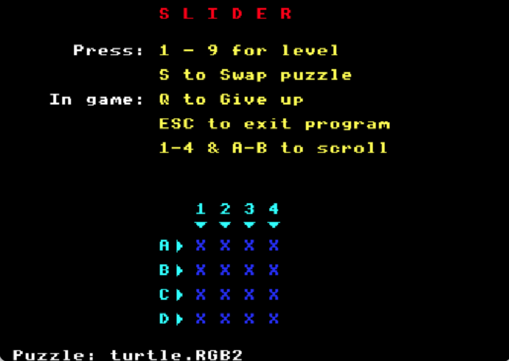
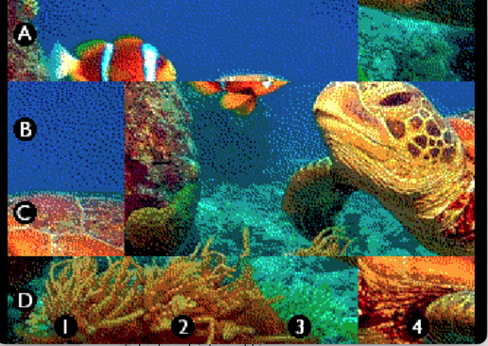
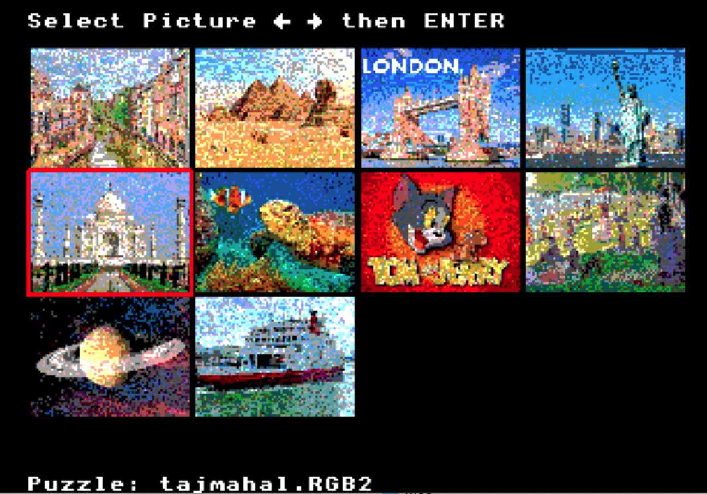

### Slider - a pictorial puzzle game

Loads a large colour bitmap's data from file into a buffer in chunks. 
Splits image up into 16 pieces.

Mixes up puzzle to chosen level of difficulty.

Use keys to slide the puzzle pieces back into the correct positions.

Choose a different picture from up to 10 placed in 'puzzles' folder.
Images need to be 320x240 RGBA2222 format. ie, 76,800 bytes in size.

## Install instructions

Place the `slider.bin` file on the SD card, plus the `puzzle` folder at the same level of the SD card.

Run `slider`.

